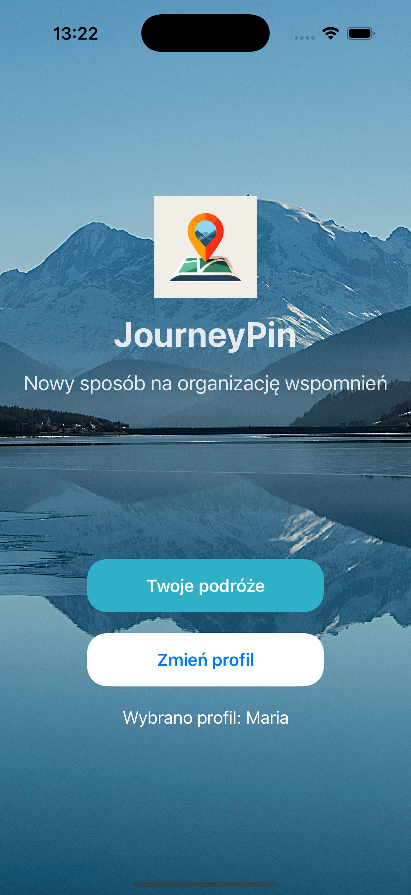
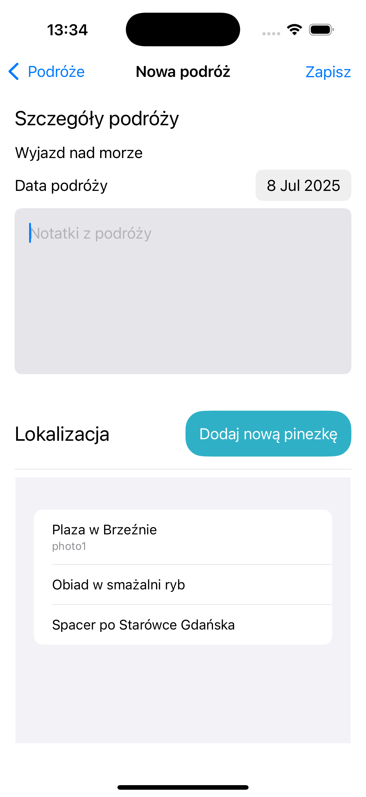

# JourneyPin 📍

**A New Way to Organize Your Travel Memories**

JourneyPin is a modern iOS application that allows users to organize and store their travel memories in an intuitive way. The app combines map functionality with the ability to add photos and notes, creating a digital travel journal.

## 🌟 Features

### 📱 Core Functionality

- **User Profile Management** - Create and switch between different user profiles
- **Journey Creation** - Add new trips with names, dates, and notes
- **Interactive Maps** - Mark locations on the map with customizable pins
- **Photo Gallery** - Attach photos to specific locations
- **Journey Editing** - Modify existing trips and locations
- **Travel History** - Browse through all your past adventures

### 🗺️ Map Features

- **Pin Management** - Add, edit, and delete location pins
- **Photo Integration** - Select and attach photos from your gallery to specific pins
- **Location Editing** - Drag and reposition pins on the map
- **Visual Journey Tracking** - See all your journey locations at a glance

## 📱 Screenshots

### Home & User Management

| Home View                               | Users List                                | Add New User                                  |
| --------------------------------------- | ----------------------------------------- | --------------------------------------------- |
|  |  |  |

### Journey List Management

| Empty Journey List                                      | Journey List                                  | Delete Journey                                              |
| ------------------------------------------------------- | --------------------------------------------- | ----------------------------------------------------------- |
|  |  |  |

### Adding New Journey & Pins

<table align="center">
  <tr>
    <th>Add New Journey </th>
    <th>Add Pin (Empty)  </th>
    <th>Select Photo  </th>
    <th>Pin Complete  </th>
  </tr>
  <tr>
    <td>
      
    </td>
    <td>
      
    </td>
    <td>
      
    </td>
    <td>
      
    </td>
  </tr>
</table>

### Journey Details & Options

<table align="center">
  <tr>
    <th>Journey Details</th>
    <th>Journey Options</th>
  </tr>
  <tr>
    <td>
      
    </td>
    <td>
      
    </td>
  </tr>
</table>

### Editing Features

<table align="center">
  <tr>
    <th>Edit View</th>
    <th>Delete Options</th>
    <th>Change Pin Position</th>
  </tr>
  <tr>
    <td>
      
    </td>
    <td>
      
    </td>
    <td>
      
    </td>
  </tr>
</table>

## 🏗️ Technical Architecture

### Core Data Model

- **User** - User profile management
- **Trip** - Journey/trip information
- **Pin** - Location markers with coordinates

### Key Views

- `HomePageView` - Main dashboard
- `JourneyListView` - Trip overview and management
- `MapView` - Interactive map interface
- `AddJourneyView` - Create new trips
- `EditJourneyView` - Modify existing trips
- `ShowTripView` - Display trip details

### Technologies Used

- **SwiftUI** - Modern declarative UI framework
- **Core Data** - Local data persistence
- **MapKit** - Interactive map functionality
- **PhotosPicker** - Image selection and management

## 🚀 Getting Started

### Installation

1. Clone the repository

```bash
git clone [repository-url]
```

2. Open the project in Xcode

```bash
open journeypin.xcodeproj
```

3. Build and run the project

- Select your target device or simulator
- Press `Cmd + R` to build and run

## 🎯 Usage

1. **Create a User Profile** - Start by adding a new user profile
2. **Add a Journey** - Create a new trip with a name and description
3. **Mark Locations** - Tap on the map to add pins to interesting locations
4. **Attach Photos** - Add photos from your gallery to each pin
5. **Edit and Organize** - Modify your trips and locations as needed
6. **Browse Memories** - View all your journeys and relive your adventures

## 🔧 Development

### Project Structure

```
journeypin/
├── Views/           # SwiftUI view components
├── Models/          # Core Data models
├── Assets/          # Images and resources
└── Persistence/     # Data management
```

### Core Data Schema

- Relationships between User, Trip and Pin entities
- Automatic data persistence and synchronization
- Optimized for performance and memory usage

## 👥 Authors

- **Maria** - _[https://github.com/MariaBrodowska](https://github.com/MariaBrodowska)_
- **Mateusz** - _[https://github.com/MateuszBrankiewicz](https://github.com/MateuszBrankiewicz)_
- **Adam** - _[https://github.com/ThePowerOf76](https://github.com/ThePowerOf76)_

---
